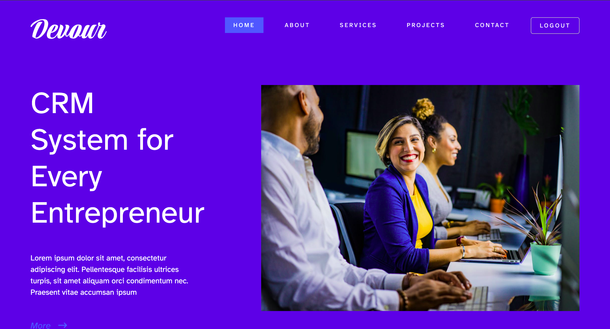
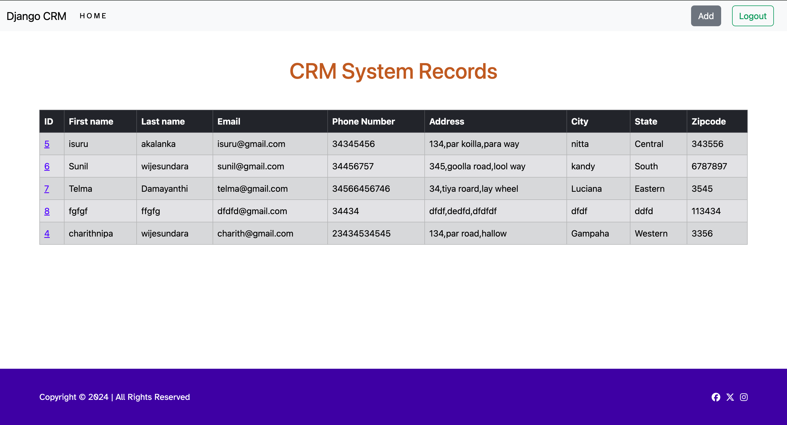
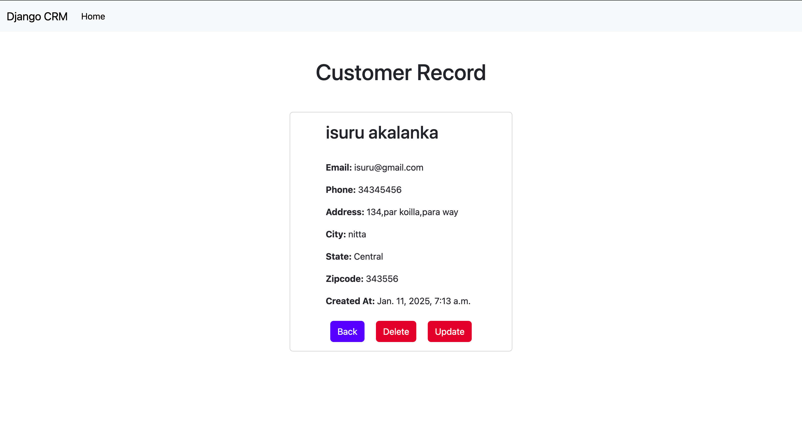
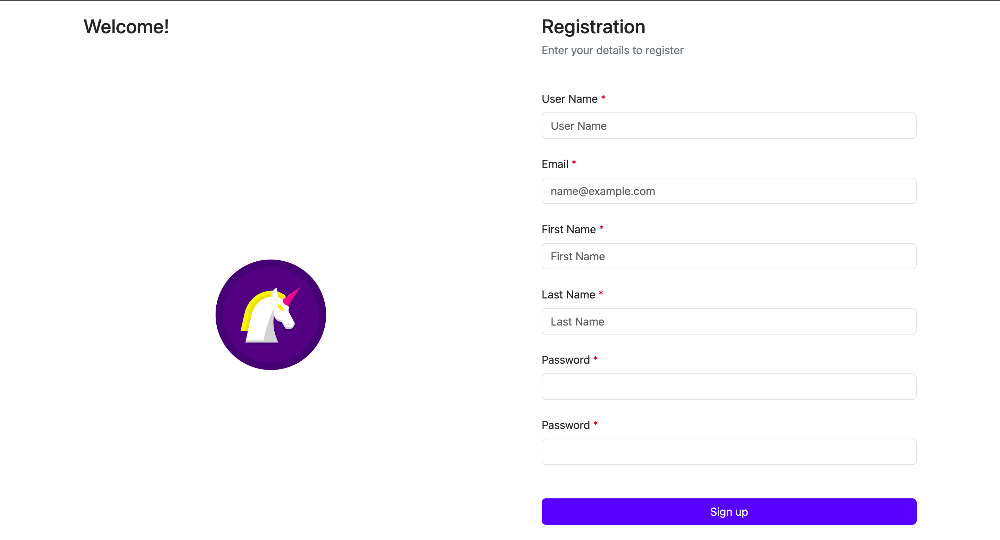

# Django CRM Project

## you need to setup a postgres database first.
 configure the database settings in `dcrm/settings.py`

1. Create a virtual environment using `python3 -m venv venv`
2. Activate the virtual environment using `source venv/bin/activate`
3. Install the required dependencies using `uv sync`
4. Create a superuser using `python manage.py createsuperuser`.
5. migrate the database using `python manage.py makemigrations`
6. migrate the database using `python manage.py migrate`. 
7. Run the development server using `python manage.py runserver`

